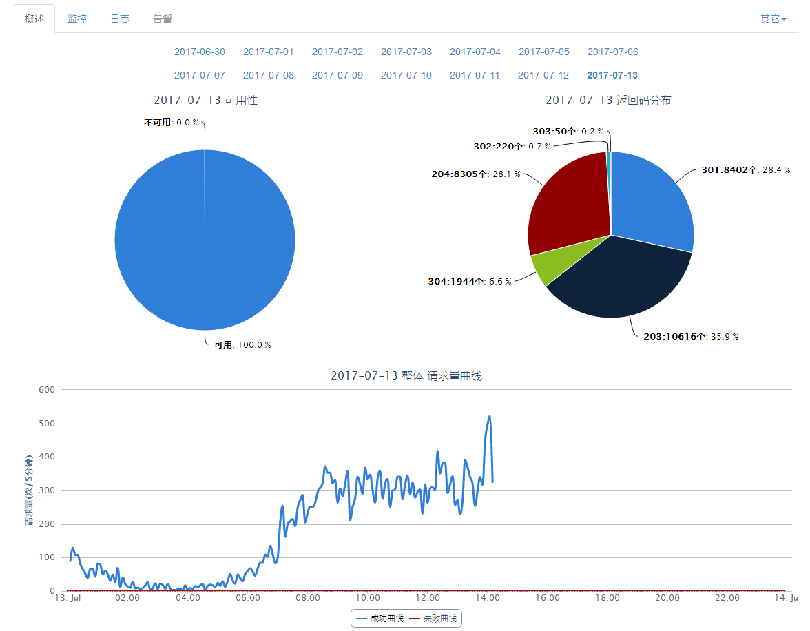
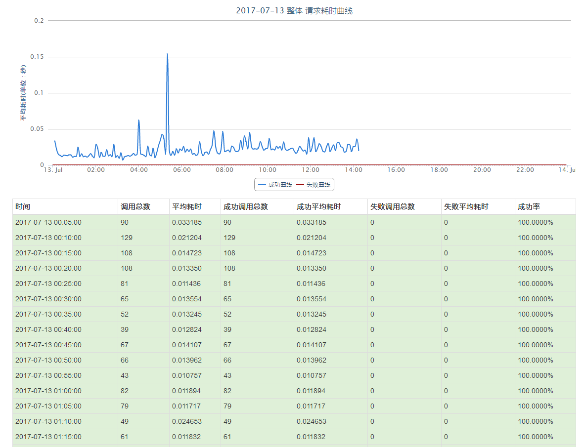
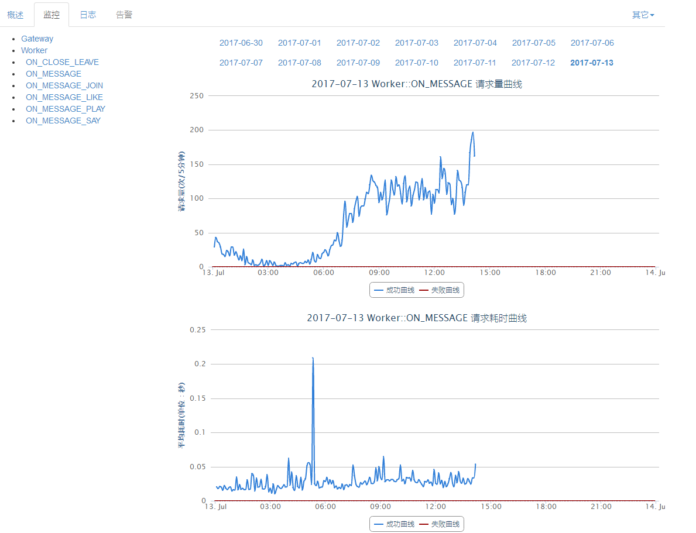

CoolChatServer
=================

CoolChatServer是基于GatewayWorker开发的一个项目，用于CoolChat的IM服务以及推送等。

## GatewayWorker  
该文件夹中的代码是服务端的IM服务代码。使用方法具体请看[这里][1]。

## GatewayWorkerStatistics  
该文件夹中的代码是服务端IM服务监控的代码。使用方法具体请看[这里][2]。

## 监控  
总览
   

请求耗时监控
  
 
请求量监控
 

[1]:./GatewayWorker/README.md
[2]:./GatewayWorkerStatistics/README.md